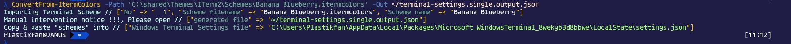
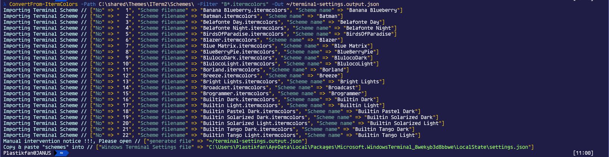
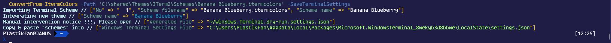
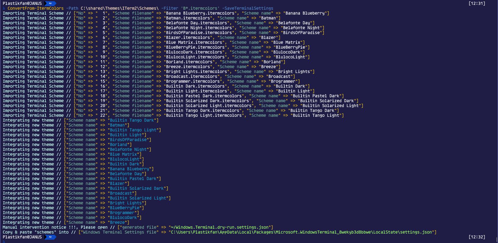
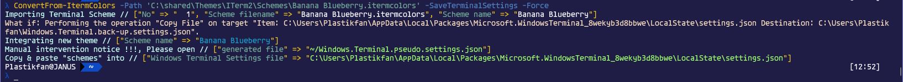
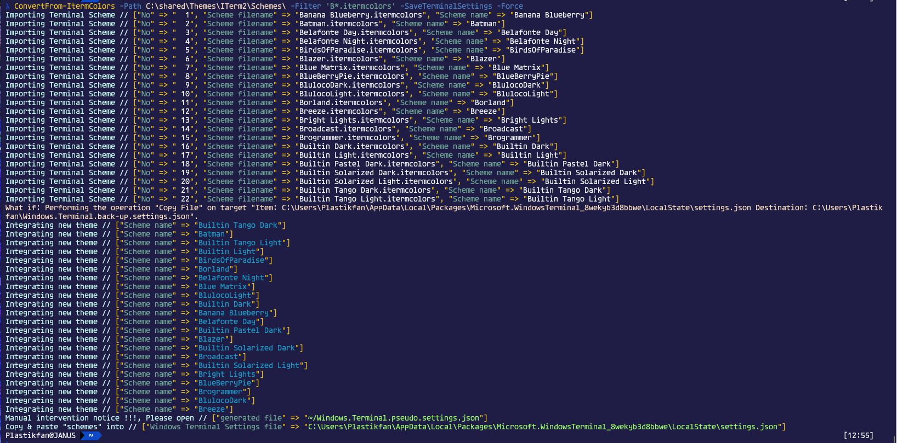

# Elizium.FakeBuddy

*Utility module for Windows Terminal.*

The new [Windows Terminal](https://github.com/Microsoft/Terminal) is a great replacement for the tiring and aging console. However, in it's current form, it is not very easy to configure owing to there not being a Settings UI. On top of that, it is not easy to leverage the fine work of others in the creation of [schemes](https://github.com/mbadolato/iTerm2-Color-Schemes) for other console/terminal style applications on other platforms; more specifically, [iterm2](https://iterm2.com/).

*FakeBuddy* aims to be a stop gap that performs bulk conversion of iterm colour schemes to be used within Windows Terminal.

## Installation

Terminal Buddy is a powershell module published on [PowerShellGallery](https://www.powershellgallery.com/packages/Elizium.FakeBuddy) and can be installed using the **install-module** command:

> install-module -Name Elizium.FakeBuddy

or to install for all users:

> install-module -Name Elizium.FakeBuddy -scope ALLUSERS

Note, this needs be executed under an elevated admin powershell session.

## Dependencies

This module is dependent on the [Elizium.Krayola](https://www.powershellgallery.com/packages/Elizium.Krayola), which should be installed automatically.

## Import iterm schemes into Windows Terminal

This can be achieved by running the **ConvertFrom-ItermColors** command which has the following parameters

* Path (mandatory): path to folder containing term colour schemes (usually *.itermcolors)
* Filter (optional): filter to apply to files found in *Path*
* Out (optional): if present, then is a path to the file written to contain the converted schemes
* SaveTerminalSettings (optional switch): if present, save a complete terminal setting files
* Force (optional switch): must be used with *SaveTerminalSettings*, writes live settings file (caveat applies)
* DryRunFile (optional switch): if *SaveTerminalSettings* set without *Force* (the recommended use case), writes a complete settings file to this path.
* BackupFile (optional): When *SaveTerminalSettings* with *Force* to write the live setting file, this is the path the backup of the live settings file.
* ThemeName (optional): The name of a Theme contained in the $KrayolaThemes global hash table variable. This is just for aesthetics and the default can be used.

There are quite a few parameters here, but thankfully, they don't all need to be specified as there are reasonable defaults for most.

There are multiple ways to use this function:

* [Generate an Output](#Generate-Out-file) file (denoted by $Out parameter), which will contain a JSON object containing the colour schemes converted from iterm to Windows Terminal format.
* [Generate a new Dry](#Dry-Run-mode) Run file which is a copy of the current Windows Terminal Settings file with the converted schemes integrated into it.
* [Live settings update](#Live-settings-update) make a backup, of the Settings file, then integrate the generated schemes into the current Settings file. (See caveats further down below).

The function errs on the side of caution, and by default works in 'Dry Run' mode. Due to the caveats, this method is effectively the same as not using the $SaveTerminalSettings switch, using $Out instead, because in this scenario, the user would be expected to open up the generated file and copy the generated scheme objects into the current Settings file. This is the recommended way to use this command.

If the user wants to integrate the generated schemes into the Settings file automatically, then the $Force switch should be specified. In this case, the current live Settings file is backed up and then over-written by the new content. Existing schemes are preserved.

:heavy_exclamation_mark: And the caveats ...

* For some reason, Microsoft decided to include comments inside the JSON setting file (probably in lieu of there not being a proper settings UI, making configuring the settings easier). However, comments are not part of the current JSON schema (although they are permitted in the rarely and sparsely supported json5 spec), which means that this conversion process will not preserve the comments. There is an alternative api that supposedly supports non standard JSON features, newtonsoft.json.ConvertTo-JsonNewtonsoft/ConvertFrom-JsonNewtonsoft but using these functions yield unsatisfactory results.
* ConvertFrom-Json/Converto-Json do not properly handle the profiles

### Generate Out file

#### Convert a single file into Out file

> ConvertFrom-ItermColors -Path 'C:\shared\Themes\ITerm2\Schemes\Banana Blueberry.itermcolors'  -Out ~/terminal-settings.single.output.json

Converts single file *Banana Blueberry.itermcolors* into the output file *~/terminal-settings.single.output.json*

#### Bulk convert multiple files into Out file

> ConvertFrom-ItermColors -Path C:\shared\Themes\ITerm2\Schemes -Filter "B*.itermcolors" -Out ~/terminal-settings.output.json

This converts all itermcolors files beginning with *B*, found in *C:\shared\Themes\ITerm2\Schemes* and creates an output file *~/terminal-settings.output.json* which is a JSON object with a single *schemes* property with the converted schemes.

### Dry Run mode

#### Convert a single file into Dry Run file

> ConvertFrom-ItermColors -Path 'C:\shared\Themes\ITerm2\Schemes\Banana Blueberry.itermcolors' -SaveTerminalSettings

Converts single file *Banana Blueberry.itermcolors* scheme, merges into live settings file, writing to the default dry run file (*~/Windows.Terminal.dry-run.settings.json*)

#### Bulk convert multiple files into Dry Run file

> ConvertFrom-ItermColors -Path C:\shared\Themes\ITerm2\Schemes\ -Filter 'B*.itermcolors' -SaveTerminalSettings

This converts all itermcolors files beginning with *B*, found in *C:\shared\Themes\ITerm2\Schemes*, merges into live settings file, writing to the default dry run file (*~/Windows.Terminal.dry-run.settings.json*)

### Live settings update

*de-activated, until caveats can be resolved, if ever* :zzz:

#### Convert a single file into Live settings file

> ConvertFrom-ItermColors -Path 'C:\shared\Themes\ITerm2\Schemes\Banana Blueberry.itermcolors' -SaveTerminalSettings -Force

Converts single file *Banana Blueberry.itermcolors* scheme, merges into live settings file, (in theory overwriting live settings file), but instead writing to *~/Windows.Terminal.pseudo.settings.json*.

#### Bulk convert multiple files Live settings file

> ConvertFrom-ItermColors -Path C:\shared\Themes\ITerm2\Schemes\ -Filter 'B*.itermcolors' -SaveTerminalSettings -Force

This converts all itermcolors files beginning with *B*, found in *C:\shared\Themes\ITerm2\Schemes*, merges into live settings file, (in theory overwriting live settings file), but instead writing to *~/Windows.Terminal.pseudo.settings.json*.

## Manual intervention required

After the output file has been generated, as the command indicates at the end of it's run, the user needs to manually copy over the generated schemes from the *schemes* property directly into the *schemes* entry in the live Terminal Settings file, (usually in *'~\AppData\Local\Packages\Microsoft.WindowsTerminal_8wekyb3d8bbwe\LocalState\settings.json'*). Since the schemes already defined before the command was run, are merged with the new ones, it is safe to simply copy and over-write the existing schemes property without fear of losing the old ones.

This step is only require because of the caveats previously described.

## ... And finally

In case you're wondering what iterm scheme is illustrated in the screen shots, it is the [AdventureTime](https://github.com/mbadolato/iTerm2-Color-Schemes/blob/master/schemes/AdventureTime.itermcolors) and the font is [agave NF r](https://www.nerdfonts.com/).

If you're not sure which iterm scheme to use, just download the whole pack from [iterm2-color-schemes](https://iterm2colorschemes.com/), and use Terminal Buddy to bulk convert as many as you'd like to try.
